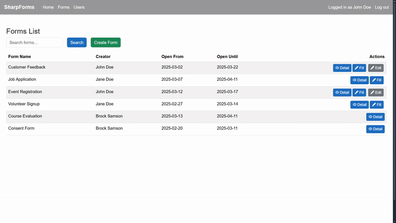

# SharpForms

SharpForms is a .NET Blazor Web application designed to create, edit, fill and manage forms.

## Features
- **Forms management** - Create custom forms with various field types.
- **Manage responses from other users** – View completed forms of other users.
- **Edit existing forms** - See the detail of existing forms and edit their structure

## Requirements
- **.NET 8 SDK**

## Setup and usage

1. Clone the repository `git clone git@github.com:masterofannihilation/SharpForms.git`
2. `cd project/SharpForms/`
3. `dotnet restore`
4. `dotnet build`

## Authors
- Boris Hatala (https://github.com/masterofannihilation)
- Michal Krulich (https://github.com/MichaelTheSynthCat)
- Stanislav Letaši (https://github.com/stan-leetasi/uni-information-system)
